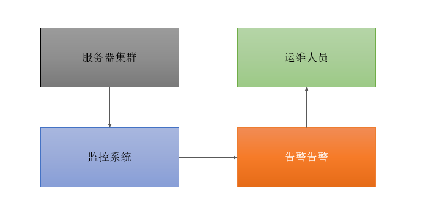
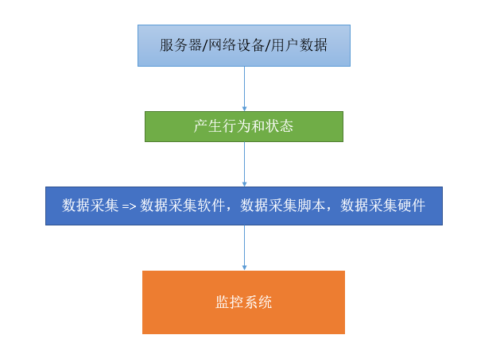

## 运维是什么？
>说白了就是管理服务器，保证服务器给线上产品提供稳定的服务环境。
## 监控室什么？
>说白了就是一种形式 盯着 观察服务器的各种行为表现都显示出来，用以发现问题和不足。
## 报警是什么？
>监控和报警两个词一定要分开说 分开理解！监控室监控，报警是报警。
监控是把行为表现展示出来，用来观察的报警规则是当监控获取的数据发生异常并且达到某个临界点的时候，采用各种途径来通知用户，管理员，运维人员，老板。

  
  
监控告警基本流程

  
  
数据收集基本流程

</div