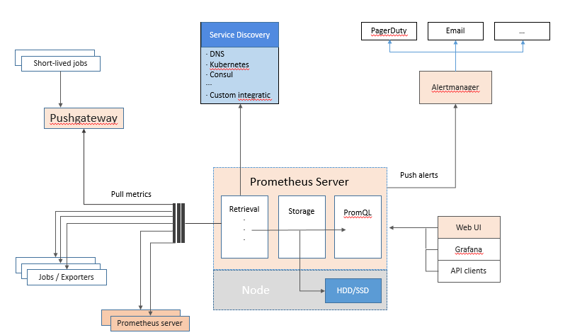

## Promethes 基础架构图



## 监控系统设计
>设计部分包括如下类容。
* 评估系统的业务流程 业务种类 程序代码不同，系统架构不同
对于企业的产品不同，业务方向不同，程序代码不同，系统架构更不同。对于各个地方的细节，都需要有一定的程度的认知才可以开启设计。
* 分类出所需的监控项种类  
一般可分为：  
1. 业务级别监控
2. 系统级别监控
3. 网络监控
4. 程序代码监控
5. 日志监控
6. 用户行为监控
7. 其他种类的监控
  
* 大的分类，还有更多小分类  
例如：  
· 业务系统 可以包括 用户访问QPS,DAU日活，访问状态，业务接口，产品转化率，充值额度，用户投诉 等等这些比较宏观的概念。  
· 系统监控 主要是跟操作系统相关的基本监控项 CPU / 内存 / 硬盘 / IO / TCP链接 / 流量 等等。  
· 网络监控 对网络状态的监控 互联网公司必不可少 但是很多时候又被忽略例如：丢包率 延迟 等等  
· 日志监控 监控中的重头戏，往往单独设计和搭建，全部种类的日志都有需要采集  
· 程序监控 一般需要和开发人员配合，程序中嵌入各种接口获取数据 或者特殊的日志格式。  


* 监控技术的方案/软件选取  
各种监控软件层出不穷，开源的 自行开发的 几百种的可选方案  
架构师凭借一些因素 开始选材  
针对企业的架构特点 大小 种类 人员多少 等等选择合适的技术方案。

## Prometheus 优缺点
>Prometheus 相比其他老款监控的不可替代性的巨大优势，以及一些不足有待提高的地方。  
### 优点：
* 监控数据的精细程度 绝对是第一的 可以精确到 1~5 秒的采集精度 4 5 分钟 理想的状态 我们来算算采集的精度
* 集群部署的速度 监控脚本的制作（指熟练之后），非常快速 大大缩短监控的搭建时间成本
* 周边插件很丰富 大多数不需要自己开发了
*本身基于数学计算模型，大量的实用函数 可以实现复杂规则的业务逻辑监控 （例如QPS的曲线 弯曲 凸起 下跌的 比例等等模糊概念）
* 可以嵌入很多开源工具的内部 进行监控 数据更准时 更可信 （其他监控很难做到这一点）
* 本身是开源的，更新速度快，bug 修复快。支持N 多种语言做自身与插件的二次开发
* 图形很高大上 很美观 老板特别喜欢看这种业务图（主要是指跟Grafana结合）  
### 不足：
* 因其数据的精度 如果集群数据太大，那么单点的监控有性能瓶颈 目前不支持集群 只能workaround
* 学习成本太大， 尤其是其独有的数据命令行（非常强大的同时 又及其难学《= 自学的情况下），中文资料极少，本身的各种数学模型的概念很复杂。
* 对磁盘资源也是耗费的较大，这个具体要看 监控的集群量 和 监控项的多少 和保存时间的长短。
* 本身的使用 需要使用者的数学不能太差 要有一定的数学头脑，这个才是最难克服的。

## Prometheus Metric Type
### Counter
*  单调递增计数器
### Gauge
* 仪表，也可以认为是一种计数器，不过支持加和减。例如：Node 中的负载数据。
### Histogram
* 直方图常用于请求持续时间或者响应大小采样，然后将结果记录到存储桶，每一个桶为累加数据。通过三个metrics 名称来完整暴露一组Histogram：
* 桶累积计数器， \<basename>_bucket{le="\<upper inclusive bound>"}
* 所有观察值的总和，\<basename>_sum
* 已经观察到的事件计数， \<basename>_count 与上述相同 \<basename>_bucket{le="+Inf"}
* 例如K8S 中的Pod启动耗时：
```
kubelet_pod_start_duration_seconds_bucket
kubelet_pod_start_duration_seconds_count #进行过pod start 的数量
kubelet_pod_start_duration_seconds_sum #总耗时
```
### Summary
* Summary 与Histogram 相似，也是通过三个metrics 名称来完整暴露一组Summary, 不过Summary是直接在客户端帮我们计算出了百分位数（Histogram 则使用 histogram_quantile 函数计算的）
* φ 分位数(0 ≤ φ ≤ 1)，<basename>{quantile="<φ>"}
* 所有观察值的总和，<basename>_sum
* 已观察到的事件计数，<basename>_count
* 例如cgroup操作延迟：
```
kubelet_cgroup_manager_latency_microseconds
kubelet_cgroup_manager_latency_microseconds_sum
kubelet_cgroup_manager_latency_microseconds_count
```


