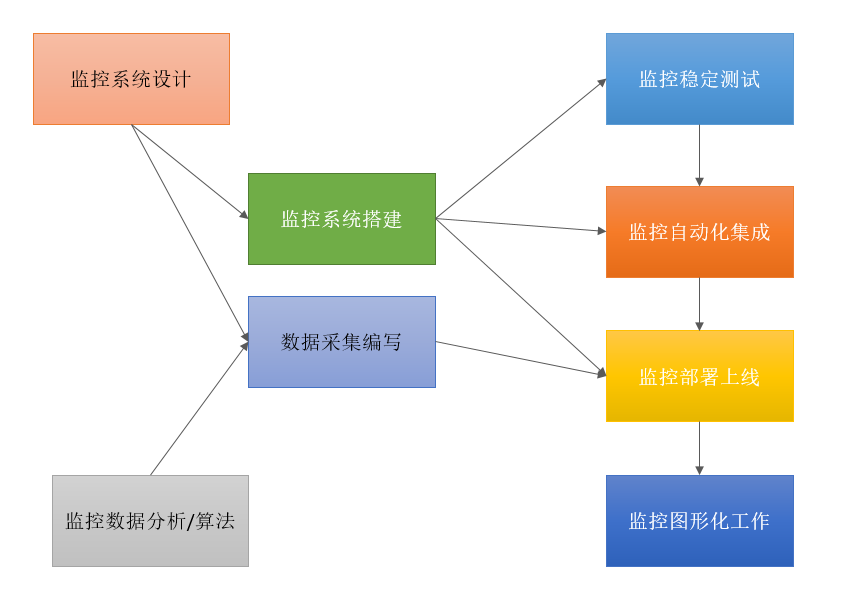

## 监控系统体系

### 监控系统设计
>设计部分包括如下类容。
* 评估系统的业务流程 业务种类 程序代码不同，系统架构不同
对于企业的产品不同，业务方向不同，程序代码不同，系统架构更不同。对于各个地方的细节，都需要有一定的程度的认知才可以开启设计。
* 分类出所需的监控项种类  
一般可分为：  
1. 业务级别监控
2. 系统级别监控
3. 网络监控
4. 程序代码监控
5. 日志监控
6. 用户行为监控
7. 其他种类的监控
  
* 大的分类，还有更多小分类  
例如：  
· 业务系统 可以包括 用户访问QPS,DAU日活，访问状态(http code)，业务接口(登录，注册，聊天，上传，留言，短信，搜索)，产品转化率，充值额度，用户投诉 等等这些比较宏观的概念。  
· 系统监控 主要是跟操作系统相关的基本监控项 CPU / 内存 / 硬盘 / IO / TCP链接 / 流量 等等。  
· 网络监控 （IDC）对网络状态的监控 互联网公司必不可少 但是很多时候又被忽略例如：丢包率 延迟 等等  
· 日志监控 监控中的重头戏(Splunk,ELK)，往往单独设计和搭建，全部种类的日志都有需要采集  
· 程序监控 一般需要和开发人员配合，程序中嵌入各种接口获取数据 或者特殊的日志格式。

### 监控系统的搭建
* 单点服务的搭建（prometheus)
* 单点客户端的部署
* 单点客户端服务器测试
* 采集程序单点部署
* 采集程序批量部署
* 监控服务器HA /cloud(自己定制)
* 监控数据图形化搭建（grafana)
* 报警系统测试
* 报警规则测试
* 监控+报警联合测试
* 正式上线监控

### 数据采集的编写
* 可选用脚本作为数据采集途径  
例如： shell / python / awk / lua / perl / go 等  
shell： 运维的入门脚本，任何和性能/后台/界面 无关的逻辑 都可以实现最快速的开发 （shell 是运维领域里 开发速度最快难度最低的）  
python：各种扩展功能 扩展库 功能丰富，伴随各种程序的展示+开发框架（如django) 等 可以实现快速的中高档次的平台逻辑开发。目前在运维界 除了shell 这个所有人必须会的脚本之外，火爆程度就属python了  
awk： 本身是一个使用的命令，也是一门庞大的编程语言，结合shell 脚本 或独立 使用都可以。在文本的标准输出处理上 有很大的优势  
lua： 多用于nginx 的模块结合 是比较新型的一个语言  
php： 老牌的开发语言， 在大型互联网开发中，目前有退潮的趋势，不过在运维中 工具开发还是比较依赖PHP  
perl：传说中 对文本处理最快的脚本语言（但代码可读性不强）  
go： 新型的语言 目前在开发和运维中 很热门 在各种后端服务编写上 开发速度快 成型早。  
作为监控数据采集， 我们首推 shell / python, 如果说 数据采集选取的模式 对性能/后台/界面 不依赖， 那么shell 速度最快 成本最低<b style="color: #336321">（公司往往最喜欢快的）</b>  

* 数据采集的形式分  
）一次性采集： 例如我们使用比较简单的 shell + crontab 的形式按 10秒 / 30 秒 / 一分钟 这样的频率 去 单次采集。  
这种形式的优点=》 一次性采集的模式 不容易出现各种错误 和 性能瓶颈，且开发逻辑简单 实现速度快。  
这种形式的缺点=》 一次采集 对于有些采集项目 实现起来不够智能 也不够到位 例如 日志的实时采集 （使用一次性采集 也可以实现 但是很low 不够准确 不够直观）  
）后台采集： 采集程序以守护进程运行在后台，持续不断的采集数据： 例如 python/go 开发的daemon 程序 后台持续不断的采集  
优点： 后台采集程序 数据准确性高 采集密度精细 管理方便  
缺点： 后台采集程序 如果开发过程不够仔细 可能会出现各种 内存泄露 僵尸进程 性能瓶颈的问题 且开发周期长  
）桥接采集： 本身以后台进程运行 但是采集不能独立 依然跟服务器关联 以桥接方式收集采集数据 例如： NRPE for nagios  

* 监控数据分析和算法
监控数据的采集 其实属于最基本的最小监控单位数据采集
例如： 采集CPU 的七种 等待状态参数，采集用户每秒请求量QPS 对于这些 “基本单位” 的数据采集 本身是必须的 也是没有疑问的  
但是这里有一个问题：  
采集回来的单位数据 如果没有懂行的人 将他们形成 监控公式 和报警阙值 那么采集数据就没有任何意义了  
另外还有一个问题：  
例如业务级别监控的算法 运维自身无法做到十分专业  
因为本身跟操作系统无关， 是跟数据算法相关  
-- 举一个简单的例子： 如果我们想通过Prometheus 实现对用户访问QPS的 精确控制  
那么对于 监控图形 曲线QPS 上涨 QPS 下跌， QPS 凸起和历史数据的比较方法 等等 这些 对属于业务级别的监控阙值类型。  
需要对有专业的数据分析人员的协助 才可以算出优良的算法  
例如： 如果我现在相对当前QPS 下跌进行报警计算， 那么用什么样的公式针对我们的业务类型更贴切 ？  
我是选择 计算当前5分钟内的平均值 当 < 一个固定数值的时候报警合适 ？  
我是选择 计算当前10分钟的总量 然后 和前一个小时同一时间段比较合适？  
我是选择 计算当前一个小时的平均值 和过去一周内 每天的同一段的时间比较合适？  
...  
以此类推，这些数据算法 本身和Linux 无关， 只有非常专业的数据计算团队 才可以给出一个最合理的算法 协助我们的报警规则制定  

### 监控稳定性测试
>不管是一次性采集， 还是后台的采集, 只要在Linux 上运行的东西 都会多多少少对上系统产生一定的影响。  
稳定性测试 就是通过一段时间的单点部署观察 对线上有没有影响

### 监控自动化
>监控客户端的批量部署， 监控服务端的HA 再安装，监控项目的修改，监控项目的监控集群变化  
种种这些地方 都需要大量的人工  
自动化的引进 会很大程度上 缩短我们队监控系统的维护成本  
这里给出几个实例： Puppet(配置文件部署)，Jenkins(CI 持续部署)， CMDB(运维自动化的最高资源管理平台 和 理念) 。。。等等  
利用好如上几个例子 就可以实现对监控自动化的掌握。

### 图形化工作
采集的数据 和转变好的监控算法， 最终需要一个好的图形展示才能发挥最好的效果。   
监控的设计搭建需要大量的技术知识，但对于一个观察者来说（老板），往往不需要多少技术，只需要能看懂图就好（例如 老板想看看 当前用户的访问量情况，想看看， 整体CPU高不高 等等）  
所有，监控成图工作，也是一个很重要的一个内容。（grafana）
